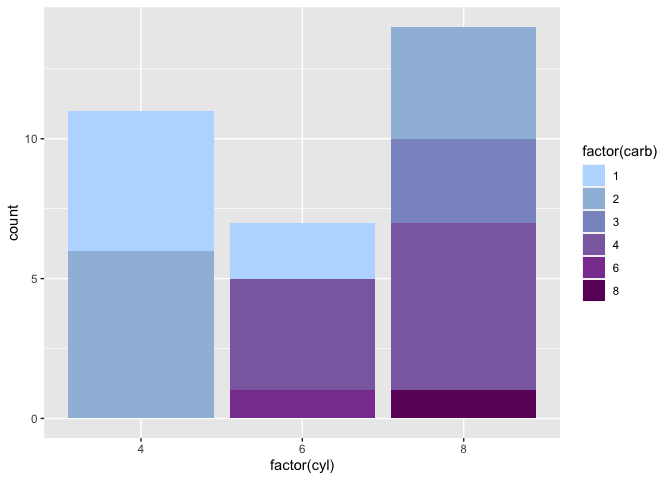
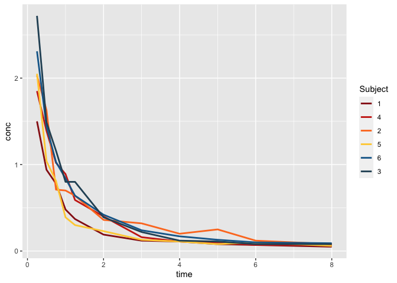
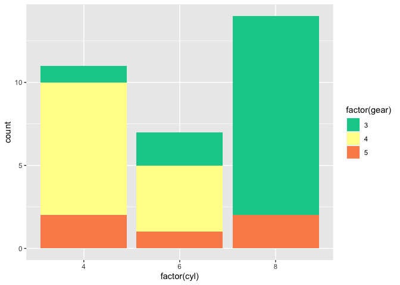
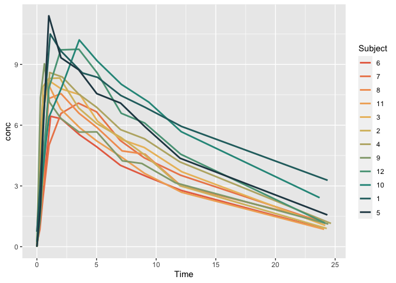
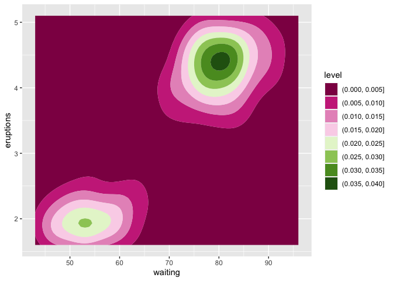
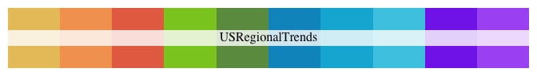

mipalettes
================

## mipalettes

Mipalettes is an R package for color palettes related to MI Umbrella and
other pandemic response projects. They include color schemes from MI
Start Map, MI Lighthouse, and various COVID levels. It was mostly meant
as a self tutorial on how to make a package (following Hilary Parker’s
[excellent super-simple
intro](https://hilaryparker.com/2014/04/29/writing-an-r-package-from-scratch/))
and is largely just a riff on Kartik Ram’s [wesanderson color palettes
package](https://github.com/karthik/wesanderson/tree/master).

## Installation

Install from GitHub using devtools:

``` r
devtools::install_github("epimath/mipalettes")
```

## Example plots

``` r
library("mipalettes")
library("ggplot2")

ggplot(mtcars, aes(factor(cyl), fill=factor(carb))) +  geom_bar() +
  scale_fill_manual(values = mipalette("MIStartMap"))
```

<!-- -->

``` r
ggplot(Indometh, aes(x = time, y = conc, color = Subject)) + geom_line(size = 1) + 
  scale_color_manual(values = mipalette("MISafeStart"))
```

<!-- -->

``` r
ggplot(mtcars, aes(factor(cyl), fill=factor(gear))) +  geom_bar() +
  scale_fill_manual(values = mipalette("CDCCommunityLevels"))
```

<!-- -->

``` r
ggplot(Theoph, aes(x = Time, y = conc, color = Subject)) + geom_line(size = 1) + 
  scale_color_manual(values = mipalette("SunForest6", n = length(unique(Theoph$Subject)), type = "continuous"))
```

<!-- -->

``` r
ggplot(faithfuld, aes(waiting, eruptions, z = density)) + geom_contour_filled() + 
  scale_fill_manual(values = mipalette("MILighthouse", n = 9, type = "continuous"))
```

<!-- -->

## All palettes

``` r
# All palettes
names(mipalettes)
```

    ##  [1] "MIStartMap"             "OldMIStartMap"          "MISafeStart"           
    ##  [4] "CDCTransmissionLevels"  "MISMTransmissionLevels" "CDCCommunityLevels"    
    ##  [7] "MISMCommunityLevels"    "MISMTequilaSunrise"     "MILighthouse"          
    ## [10] "MILighthouseSVI"        "DearEpi"                "SoM"                   
    ## [13] "USRegionalTrends"       "UMSecondaryColors"      "RetroRainbow"          
    ## [16] "RetroRainbow2"          "SunForest6"             "BeachBall"             
    ## [19] "GreyTealGold"           "BigTop"                 "BigTop2"               
    ## [22] "Midsummer"              "SummerHike"

#### MI Safe Start and MI Start Map Palettes

``` r
mipalette("MIStartMap")
```

<!-- -->

``` r
mipalette("OldMIStartMap")
```

<!-- -->

``` r
mipalette("MISafeStart")
```

<!-- -->

``` r
mipalette("MISMTransmissionLevels")
```

<!-- -->

``` r
mipalette("MISMCommunityLevels")
```

<!-- -->

``` r
mipalette("MISMTequilaSunrise")
```

<!-- -->

#### MI Lighthouse

``` r
mipalette("MILighthouse")
```

<!-- -->

``` r
mipalette("MILighthouseSVI")
```

<!-- -->

#### Dear Epi

``` r
mipalette("DearEpi")
```

<!-- -->

#### UM, State, and CDC

``` r
mipalette("CDCTransmissionLevels")
```

<!-- -->

``` r
mipalette("CDCCommunityLevels")
```

<!-- -->

``` r
mipalette("SoM")
```

<!-- -->

``` r
mipalette("USRegionalTrends") # makes US HHS regions break into West coast/East coast/etc by color group (reorderd here to look nicer though)
```

<!-- -->

``` r
mipalette("UMSecondaryColors")
```

<!-- -->

#### Miscellaneous

``` r
mipalette("RetroRainbow")
```

<!-- -->

``` r
mipalette("RetroRainbow2")
```

<!-- -->

``` r
mipalette("SunForest6")
```

<!-- -->

``` r
mipalette("BeachBall")
```

<!-- -->

``` r
mipalette("GreyTealGold")
```

<!-- -->

``` r
mipalette("BigTop")
```

<!-- -->

``` r
mipalette("BigTop2")
```

<!-- -->

``` r
mipalette("Midsummer")
```

<!-- -->

``` r
mipalette("SummerHike")
```

<!-- -->
